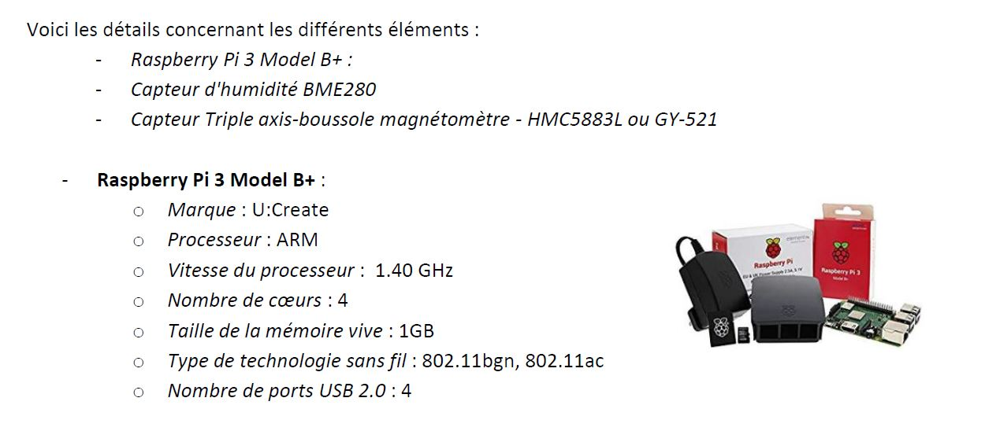
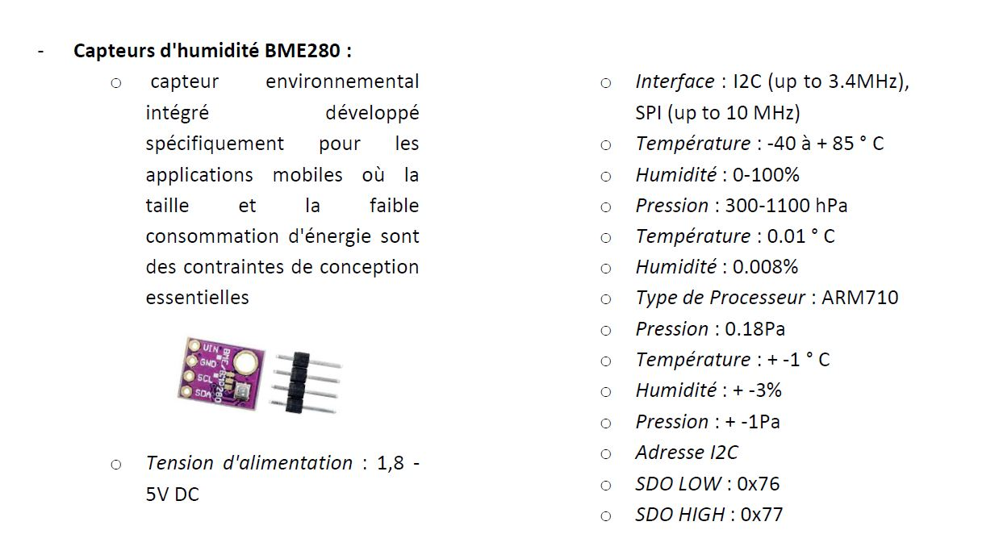
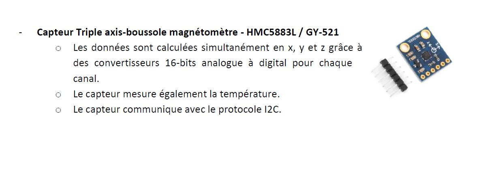

# Projet de Fin de Formation
Projet CPP pour la formation C/CPP embarqué

```
Le but de ce projet est de constituer un système de génération de logs. 
Ces logs seront destinés à être utilisés par des DataScientists.
```

```
Afin de mieux présenter les éléments, on commencera par définir les composantes de l'architecture globale. 
Ensuite, on présentera les différents composants utilisés. Pour finir, on présentera les livrables à fournir lors de la soutenance.
```
## Le système de collecte des données est découpé en plusieurs parties :

```
Dans un premier temps, on distingue 2 Raspberry interconnectés en utilisant le protocole TX/RX.
```
```
 D'un côté, l'un des Raspberry qu'on appellera "Balise" doté de différents capteurs se charge de collecter 
 régulièrement les informations fournies par les capteurs. De l'autre côté, le second Raspberry qu'on appellera 
 "Maître" via le protocole TX/RX récupère ces données. 
 
 Il va de soi qu'en cas de redémarrage de la "Balise", le programme de collecte des informations devra se relancer automatiquement. 
```

```
 Concernant le "Maître", l'intervalle de collecte doit rester paramétrable. A ces données issues des capteurs, 
 on y ajoutera les caractéristiques liées à la balise elle-même. 
```


```
Une fois ces données récupérées par le "Maître", celles-ci doivent être formatées au format json en vue de les envoyer à un serveur TCP.
```


```
 Ce serveur TCP centralisera les différentes données transmises par le "Maître" à intervalle régulier afin 
 de permettre d'établir des statistiques exploitables par les dataScientists. Par ailleurs, le Maître 
 sera doté d'un feu tricolore (Red/Yellow/Green). Chaque couleur de ce feu tricolore aura une correspondance :
```


```
- Rouge clignotant
- Yellow : Etat normal
- Green : indique la présence d'une nouvelle valeur : Etat normal : indique un transfert du maitre vers le TCP
```


```
De plus, en vue de faciliter l'exploitation des données par les Datascientists, vous constituerez une application console 
exposant les différentes informations issues du serveur TCP.
```


```
Au sein de cette application console, on pourrait par exemple :
-Obtenir les informations à un instant donné
od'un capteur
oou d'une information particulière du capteur
-Extraire des informations pour une période donnée
-…
```


```
Il s'agit ici de simples suggestions, à vous de fournir une application console regroupant desfonctionnalités 
utiles aux datascientists. 

Cette application doit être simple et conviviale.
```


## Raspberry Pi 3 Model B+ :



## Capteurs d'humidité BME280



## Capteur Triple axis-boussole magnétomètre - HMC5883L / GY-521




```
Afin de disposer de ces données, vous aurez la possibilité de vous connecter via le protocole SSH. 
Toutes les informations de connexion (adresse IP, login et mot de passe, clé) vous seront communiquées ultérieurement.

L’ensemble des travaux réalisés devra être mis sur un dépôt afin de centraliser les informations et de faciliter 
la communication entre les membres du projet. Vous ferez en sorte de bien vous répartir les tâches.

Vous constituerez une présentation (PowerPoint ou équivalent) qui vous servira de fil conducteur 
pour le jour de la soutenance. Lors de la soutenance, il va de soi que le temps de parole entre 
chacun des membres du groupe devra être équilibré.
```

# Note

```
Les développements et les tests sont réalisés en totalité sous codeBlocks pour windows 10

Les tests en ligne de commande sont réalisés sous Debian 11
```
