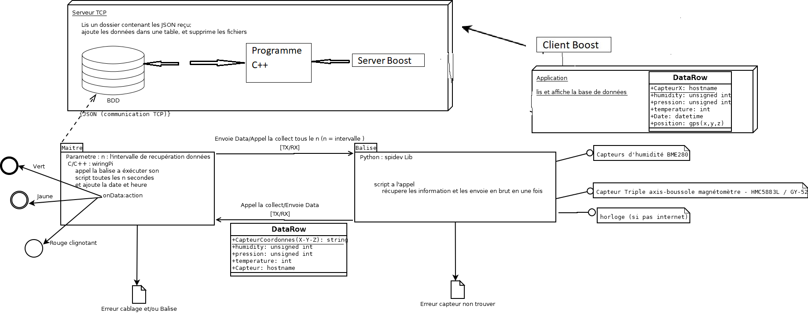
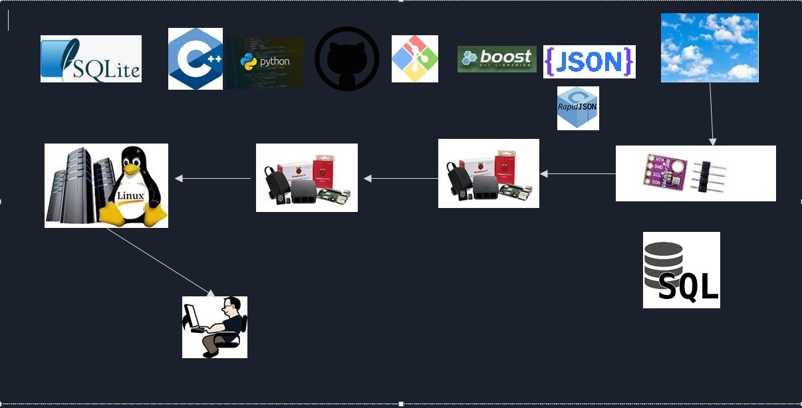

# Projet de Fin de Formation
Projet CPP pour la formation C/CPP embarqué

## Outils utilisés 
```
- C/C++
- Boost asio
- Python
- Script Shell
- Sql
- Sqlite
- Git
- GitLab
- Json
- RapidJson
```

## Introduction

```
Le but de ce projet est de constituer un système de génération de logs. 
Ces logs seront destinés à être utilisés par des DataScientists.
```

```
Afin de mieux présenter les éléments, on commencera par définir les composantes de l'architecture globale. 
Ensuite, on présentera les différents composants utilisés. Pour finir, on présentera les livrables 
à fournir lors de la soutenance.
```
## Le système de collecte des données est découpé en plusieurs parties :

```
Dans un premier temps, on distingue 2 Raspberry interconnectés en utilisant le protocole TX/RX.
```
```
 D'un côté, l'un des Raspberry qu'on appellera "Balise" doté de différents capteurs se charge de collecter 
 régulièrement les informations fournies par les capteurs. De l'autre côté, le second Raspberry qu'on appellera 
 "Maître" via le protocole TX/RX récupère ces données. 
 
 Il va de soi qu'en cas de redémarrage de la "Balise", le programme de collecte des informations devra 
 se relancer automatiquement. 
```

```
 Concernant le "Maître", l'intervalle de collecte doit rester paramétrable. A ces données issues des capteurs, 
 on y ajoutera les caractéristiques liées à la balise elle-même. 
```


```
Une fois ces données récupérées par le "Maître", celles-ci doivent être formatées au format json en vue de les 
envoyer à un serveur TCP.
```


```
 Ce serveur TCP centralisera les différentes données transmises par le "Maître" à intervalle régulier afin 
 de permettre d'établir des statistiques exploitables par les dataScientists. Par ailleurs, le Maître 
 sera doté d'un feu tricolore (Red/Yellow/Green). Chaque couleur de ce feu tricolore aura une correspondance :
```


```
- Rouge : clignotant
- Yellow : Etat normal
- Green : indique la présence d'une nouvelle valeur : Etat normal : indique un transfert du maitre vers le TCP
```


```
De plus, en vue de faciliter l'exploitation des données par les Datascientists, vous constituerez une application console 
exposant les différentes informations issues du serveur TCP.
```


```
Au sein de cette application console, on pourrait par exemple :
-Obtenir les informations à un instant donné
od'un capteur
oou d'une information particulière du capteur
-Extraire des informations pour une période donnée
-…
```


```
Il s'agit ici de simples suggestions, à vous de fournir une application console regroupant desfonctionnalités 
utiles aux datascientists. 

Cette application doit être simple et conviviale.
```


## Raspberry Pi 3 Model B+ :


## Capteurs d'humidité BME280


## Capteur Triple axis-boussole magnétomètre - HMC5883L / GY-521


```
Afin de disposer de ces données, vous aurez la possibilité de vous connecter via le protocole SSH. 
Toutes les informations de connexion (adresse IP, login et mot de passe, clé) vous seront communiquées 
ultérieurement.

L’ensemble des travaux réalisés devra être mis sur un dépôt afin de centraliser les informations 
et de faciliter la communication entre les membres du projet. Vous ferez en sorte de bien vous 
répartir les tâches.

Vous constituerez une présentation (PowerPoint ou équivalent) qui vous servira de fil conducteur 
pour le jour de la soutenance. Lors de la soutenance, il va de soi que le temps de parole entre 
chacun des membres du groupe devra être équilibré.
```

# Note

```
Les développements et les tests sont réalisés en totalité sous codeBlocks pour windows 10

Les tests en ligne de commande sont réalisés sous Debian 11
```


# Procédure installation de la librairie Boost 1_80_0

```
wget https://boostorg.jfrog.io/artifactory/main/release/1.80.0/source/boost_1_80_0.tar.gz
```

```
tar -xvzf boost_1_80_0.tar.gz
```

```
cd boost_1_80_0/
```

```
./bootstrap.sh
```

```
sudo ./b2 install threading=multi link=shared

```

## Remarque : 

```
si une vesrion ultérieure de boost est installée, il faut commencer par la désintaller, 
pour vérifier il suffit de compiler et exécuter le code ci-dessous :

```

```c++
#include <iostream>
#include <boost/version.hpp>

int main() 
{
  std::cout <<"BOOST_LIB_VERSION : "<< BOOST_LIB_VERSION << std::endl;
  return 0;
}
```

# Installation SqLite

```
sudo apt update
sudo apt upgrade
sudo apt install sqlite3
sudo apt install build-essential
```

**Pour l'édition des liens**

```
sudo apt-get install libsqlite3-dev
```

**Vérification**

```
sqlite3 --version

3.34.1 2021-01-20 14:10:07 0c55d179733b46d8d0ba4d88e01a25e10677046ee3da1d5b1581e86726f2alt1
```


# Ajout job dans crontab

```
L'intervalle d'execution du programme d'insertion en base de donnees est parametrable, 
pour le moment c'est chaque 2 minutes :
```

```
le shell "run_prog_insert_datas.sh" se trouve dans le repertoire : /home/ubuntu/projet_final/insert/
```

```shell
ls -l /home/ubuntu/projet_final/insert/run_prog_insert_datas.sh

chmod +x  /home/ubuntu/projet_final/insert/run_prog_insert_datas.sh

ls -l /home/ubuntu/projet_final/insert/run_prog_insert_datas.sh
```

```
ouvrir la table des jobs crontab .
```

```
crontab -e 

propose de choisir l'editeur de texte :
```

```
ajouter la ligne ci-dessous :
```

```c++
*/2 * * * *  cd /home/ubuntu/projet_final/insert && sh  run_prog_insert_datas.sh
```

```
De cette façon, le programme d'insertion en base, s'execute une fois toute les deux minutes.
```

# Diagramme :



# Diagramme technique


# Vue générale du fonctionnement des différentes parties



# Détails de la partie présentée dans cette page :

```
1)	Cette partie traite les données au format json que la Raspberry Maître dépose de façon périodique, 
un script shell activé par un job crontab, chaque 2 minute lance un programme écrit en c++ de traitement 
des données déposées. Le contenu du fichier est inséré en base de données, et le fichier est déplacé 
dans le dossier success si les données sont correctement formatées, dans le cas contraire, 
le fichier est déplacé dans le dossier faillures.
```

```
2)	Sur le serveur TCP, un service Boost développé en C++ exposant des méthodes de lecture de données, 
c’est une interface de service indépendante qui interroge un programme écrit en C++, qui li 
dans la base de données.
```

```
3)	A distance une application console écrite en C++ est mise à disposition des consultants.
```

```
4)	Elle permet de consulter les données selon les critères que le consultant choisi, 
cette application consomme les services d’un client Boost indépendant écrit en C++, 
c’est une autre interface, qui interroge le service Boost installé sur le server TCP, 
les données échangées entre le client et le service c'est-à-dire request et response sont au format json.
```

# Construire les exécutables :

```
Chaque partie est indépendante des autres, elle fonctionne indépendamment des autres. 
chacune compte un makefile, permettant le build et le clean.
La partie display interroge via boost asio la partie de lecture en base de données. 
```

```
Construire l'exécutable : 
```
**make build** 
```
Regrouper dans un fichier zip les fichiers cpp, hpp et le makefie
```
**make zip**
```
Supprimer les fichiers *.o, l'exécutable le zip
```
**make clean**

```
rendre les scripts shell exécutable
```
**chmod +x file_script_shell.sh**
