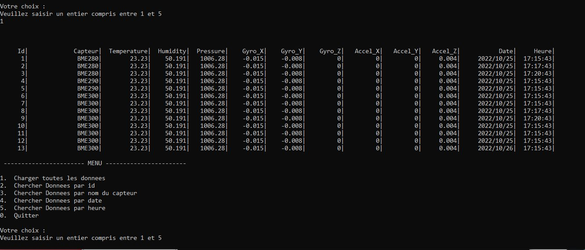

# Partie affichage des données lues en base de données


```
Via un appel distant avec Boost asio, cette partie recupère les données en base de données
qu'elle affcihe sur la console, en fonction des critères choisis par l'opérateur
```

## Exemple de données affichées par la console



# Construire les exécutables :

```
Construire l'exécutable : 
```
**make build** 
```
Regrouper dans un fichier zip les fichiers cpp, hpp et le makefie
```
**make zip**
```
Supprimer les fichiers *.o, l'exécutable le zip
```
**make clean**

