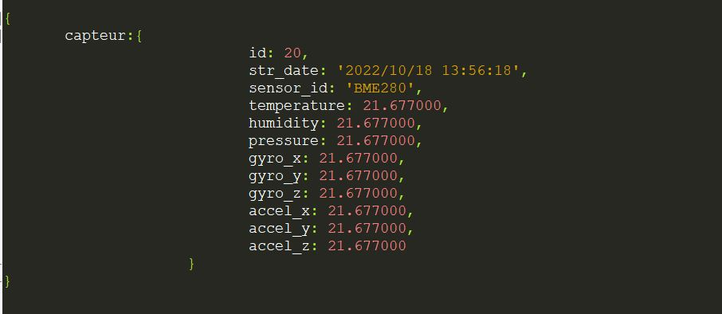

# Partie insertion en base de données


```
Cette partie traite les données au format json que la Raspberry Maître dépose de façon périodique, 
un script shell activé par un job crontab, chaque 2 minute lance un programme écrit en c++ de traitement 
d'insertion de données. Le contenu du fichier est inséré en base de données, 
et le fichier est déplacé dans le dossier success si les données sont correctement formatées, 
dans le cas contraire, le fichier est déplacé dans le dossier faillures.
```

## Exemple de données au format json traitées par le programme d'insertion en base


