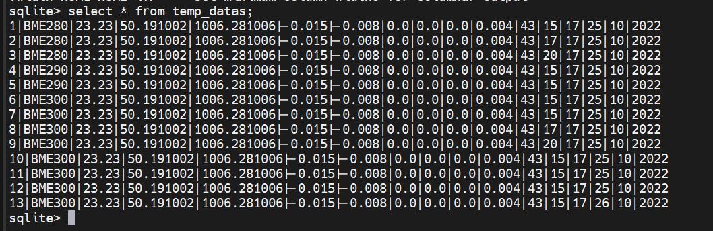

# Partie lecture en base de données et envois données par Boost asio

```
Sur le serveur TCP, un service Boost développé en C++ exposant des méthodes de lecture de données, 
c’est une interface de service indépendante qui interroge un programme écrit en C++ 'lecture', qui li dans la base de données.
```

## Exemple de données sauvées en base de données



# Construire les exécutables :

```
Construire l'exécutable : 
```
**make build** 
```
Regrouper dans un fichier zip les fichiers cpp, hpp et le makefie
```
**make zip**
```
Supprimer les fichiers *.o, l'exécutable le zip
```
**make clean**
